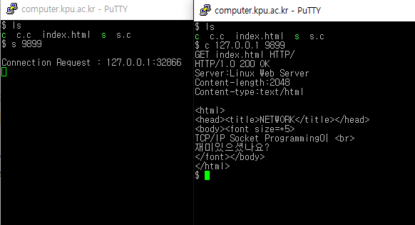

Network-Programming
===
### Date: 2016-06~
#### university programming assignments.
-------------

네트워크 프로그래밍

### HTML Read
HTML 읽기

### Send and receive files (download files to server)
파일 송수신 (서버에게 파일 다운로드 받기)

### Upload files (client-server)
파일 업로드 (클라-서버)
